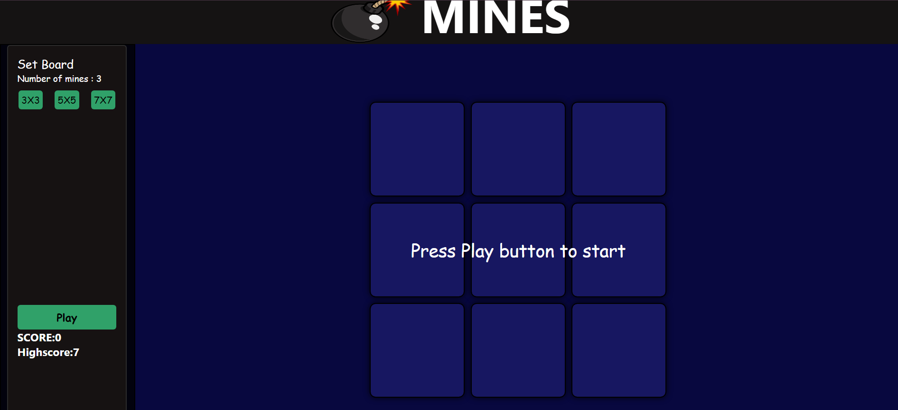
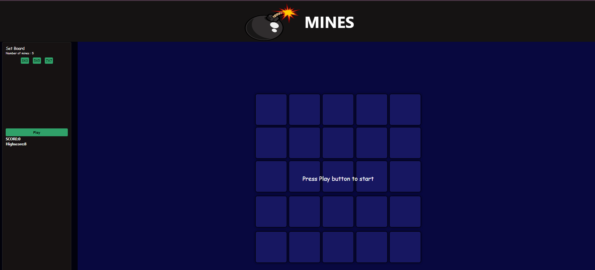
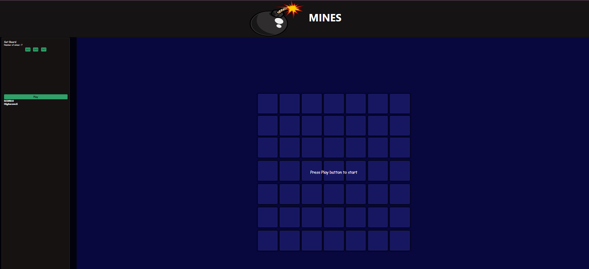
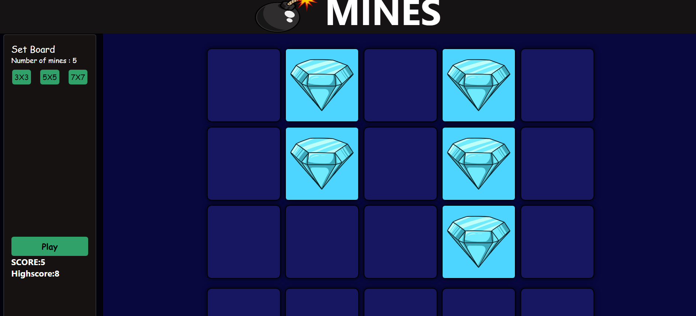
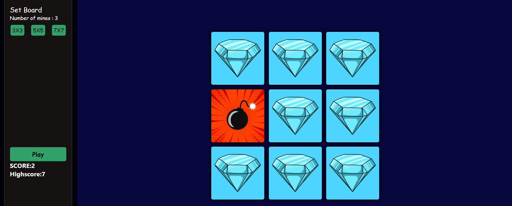

# Project Title

A mini game based on Hacksaw mines from STAKE,
Where players flip tiles on a board to collect diamonds and increase their score. However, if a player uncovers a mine, they lose the game. The goal is to collect as many diamonds as possible without hitting a mine.

## Screenshots
Player can adjust board size the number of mines increase.
Following are the images of different grid sizes



The position of mine is random player has to guess the correct block and with each block that has diamond player get +1 point.

But if the player flips block with mine GAME OVER!Score and HighScore if displayed on left side of the page and is stored locally.
 


## Deployment

To deploy this project run

```bash
  npm create-react-app [your-app-name]
  npm install 
  npm start
```


## Demo
https://main--sweepmines7.netlify.app/